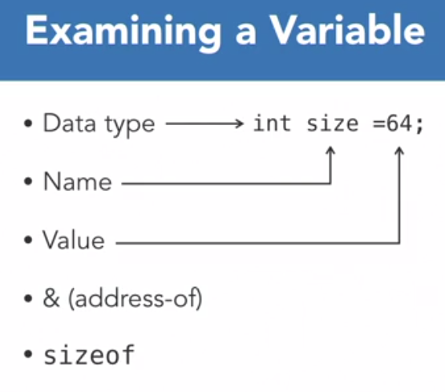

# Pointers

A Pointer is : 
- A variable that holds a memory location
- The address of another variable
- The address of a chunk of memory

But why? 
- Well part of the answer is that C is a midlevel language. In a way it's almost shorthand for assembly language which is close to the machine code spoken directly by the processor. 
- C's pointers provide access to memory locations similar to the way assembly language accesses memory directly. 
- Pointers offer a potent way to examine and manipulate data. 

Because of their low level access, using pointers involves a few rules. 

- First, a pointer is declared as a specific data type. The type matches the data the pointer must reference. So to obtain the address of a character variable, a character pointer is used. 
 ```c
 char a;
 char *ptr;
 ```
- Second and most importantly, a pointer must be initialized before it's used. This rule is true for all C language variables but more so for pointers. That's because an uninitialized pointer contains an unknown memory location which if accessed can crash the program or bring down the entire system. 

### The pointer's dual nature

The most confusing aspect of pointers is their dual nature. 

- We use the unary asterisk operator to declare a pointer, like this. `char *ptr` 
- After it's declared and initialized, the pointer is used with or without the asterisk operator. 
- Without the asterisk operator, the pointer refers to an address.
`ptr` --> An Address
- With the asterisk, it refers to the value stored at the address. `*ptr`

```c
#include <stdio.h>

int main()
{
    char a;
    char *ptr;

    /** initialze variable **/
    a = 'S';
    printf("Value of variable 'a' : %c \n",a);

    /* assign ptr to a's address */
    ptr = &a;
    printf("Address of variable 'a': %p \n",ptr);
    printf("Value of pointer 'ptr': %c \n",*ptr);

    return(0);
}

```
Output
```
Value of variable 'a' : S
Address of variable 'a': 0060FF0B
Value of pointer 'ptr': S
```

## Pointer Tools

The tools used in C to implement pointers. They fall into two categories:
- Operators 

    - The operators are the unary asterisk (`*`) , or *a pointer operator*. 
    - The unary ampersand (`&`), the *address of* operator.  
    - The `sizeof` operator, which is a key word, but also an operator. 
- Symbolic constants 
    - The symbolic constants are `NULL`, which references a pointer not assigned to any specific address
    - `size_t`, which represents a byte count, such as the number of bytes in a buffer. 
    
    These items come into play primarily when allocating memory. 
    
The operators help examine a variable. All C variables have a data type. They have a name assigned by the programmer. And they are assigned a value. 

 </br>
- The ampersand operator obtains another information tidbit, the variables address, its storage location in memory. 
- And the size of operator returns the number of bytes the variable occupies in storage. 

```c
int main()
{
    char a;

    a = 'A';

    printf("Value of variable 'a': %c \n",a);
    printf("Value of variable 'a': %p \n",&a);
    printf("Size of variable 'a': %lu \n",sizeof(a));

    return(0);

}

```
Output:
```
Value of variable 'a': A
Value of variable 'a': 0060FF0F
Size of variable 'a': 1
```

With integer

```c
#include <stdio.h>

int main()
{
	int a;
	double b;
	float c;

	/* initialize variables! */
	a = 12345;
	b = 6.0221409e23;

	printf("Value of variable 'a': %d\n",a);
	/* the address may be different from system to system */

	printf("Address of variable 'a': %p\n",&a);
	/* integers typically occupy 4 bytes in modern systems */

	printf("Size of variable 'a': %lu\n",sizeof(a));
	/* try modifying this code to change 'int' to a 'long'
	   see how the sizeof value changes */

    printf("Value of variable 'b': %e\n",b);
	/* addresses differ from system to system */
	printf("Address of variable 'b': %p\n",&b);
	/* consider changing 'double' to 'float' to see
	   whether the sizeof value changes */
	printf("Size of variable 'b': %lu\n",sizeof(b));

	return(0);
}

```

Output: 
```
Value of variable 'a': 12345
Address of variable 'a': 0060FF0C
Size of variable 'a': 4

Value of variable 'b': 6.022141e+023
Address of variable 'b': 0060FF00
Size of variable 'b': 8
```

